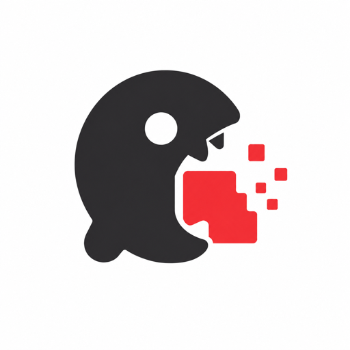

<div align="center">



# onadiet

**Put your files on a diet.**

_Shrink PDFs, images, and folders to fit under a size limit — locally, on your machine, with no uploads.
One witty command, safe by default, and it tells you exactly what it did._

**Files first — then your Docker images, repos, databases, models, and tokens.** _One verb, everything smaller._

[](https://www.npmjs.com/package/onadiet)
[](https://github.com/on-a-diet/onadiet/actions/workflows/ci.yml)
[](./LICENSE)
[](https://onadiet.pages.dev)

</div>

> [!NOTE]
> **On npm now — `npm i -g onadiet` (or `npx onadiet`).** PDF, image, SVG, and folder slimming
> are built and working — driven end-to-end against real-file golden corpora (measured results below), with v0.4 engine-hardening (bounded memory, cancellation, a `--fast` path,
> concurrent format search) done. It's **early (`0.x`)** — the API may still move; Homebrew + a Claude Code Skill are next. See [docs/99-ROADMAP.md](./docs/99-ROADMAP.md).

## Table of contents

- [The pitch](#the-pitch)
- [Before / after](#before--after)
- [The commands](#the-commands)
- [Diet plans (quality contracts)](#diet-plans-quality-contracts)
- [Why it exists](#why-it-exists)
- [How it works](#how-it-works)
- [What it is not](#what-it-is-not)
- [The bigger vision](#the-bigger-vision)
- [Packages](#packages)
- [Status & roadmap](#status--roadmap)
- [License](#license)

## The pitch

Your PDF is 40 MB and the upload form caps at 5. Your designer sent a folder that's 800 MB of oversized
images. Today you either upload your files to a stranger's server to shrink them, or you memorize
Ghostscript incantations and per-format flags.

`onadiet` puts the file on a diet **on your machine**: it figures out what's making it heavy, slims it to
hit your size target while holding a quality floor, **never touches your original**, refuses to silently
break a signed or form PDF, and hands you a receipt of exactly what changed.

```bash
diet report.pdf --to 5mb
```

```txt
report.pdf   41.2 MB → 4.7 MB   (−88.6%)
  plan:     balanced · downsampled 18 images 300→150dpi, re-encoded JPEG q≈74
  quality:  SSIM 0.981 (above floor 0.95)
  safety:   ✓ no signature, no form fields
  → wrote report.diet.pdf (original untouched)
```

No account. No upload. No cloud. It's your file; it stays your file.

## Before / after

```diff
- # upload to a random website, or:
- gs -sDEVICE=pdfwrite -dCompatibilityLevel=1.4 -dPDFSETTINGS=/ebook \
-    -dNOPAUSE -dBATCH -sOutputFile=out.pdf report.pdf   # then check the size, tweak, repeat…
+ diet report.pdf --to 5mb            # hits the target, holds quality, keeps your original, prints why
```

### Measured, not promised

The engine is proven against a real, image-heavy PDF in the golden-corpus integration suite — SpaceX's
public 9 MB IPO-roadshow deck (60 pages, 224 images). These are the **actual** `slim` results per plan, and
every number is measured on the output, never estimated:

| Plan                 | Floor (SSIM)             | 9.0 MB → | Reduction                                                   |
| -------------------- | ------------------------ | -------- | ----------------------------------------------------------- |
| `cleanse`            | lossless                 | 9.0 MB   | 0% — lossless no-op in v0.1 (structural pass not built yet) |
| `lowcarb`            | 0.96 (visually-lossless) | 8.1 MB   | ~10%                                                        |
| `balanced` (default) | 0.90                     | 4.8 MB   | ~47%                                                        |
| `keto`               | 0.80                     | 3.7 MB   | ~59%                                                        |
| `crash`              | floorless                | 3.3 MB   | ~64%                                                        |

Ask for a target instead of a plan (`--to 5mb`) and the search stops as soon as it's met — or, if the
target can't be reached without dropping below the plan's quality floor, it **refuses honestly** (keeps your
original, and tells you the smallest it could hit and to try a more aggressive plan). It never fakes the win.

**Standalone images (v0.2)** get the same treatment, proven on a real photo + graphics golden corpus
(license-clean; NASA public-domain "Blue Marble" + original artwork). Same floors, plus a **format-switch**
lever — `--format auto` re-encodes to the smallest floor-holding format (WebP/AVIF):

| Image                      | `balanced` (keep format)  | `balanced --format auto` |
| -------------------------- | ------------------------- | ------------------------ |
| Photo (JPEG, 421 KB)       | 189 KB (~55%), SSIM 0.944 | 189 KB — JPEG still wins |
| Flat graphic (PNG, 1.0 MB) | 210 KB (~79%), SSIM 0.983 | **8 KB (~99%)** → AVIF   |

On a real photograph `lowcarb` holds 0.982 SSIM (above its 0.96 floor) at ~24% smaller; on palette-friendly
graphics the WebP/AVIF switch takes savings past 99% while SSIM stays ~0.98. (SSIM measured the honest way —
a downscaled result is compared back at full size, so the number counts the downscale's cost.) Measured,
never estimated.

**SVG** (v0.2) gets its own vector pipeline via `svgo` — the diet plans map to optimization aggressiveness
(float precision is the quality knob), and `cleanse` is genuinely lossless (strips editor cruft, leaves the
geometry). A representative editor export slims **58%** on `cleanse` up to **78%** on `crash`, output always
valid SVG.

### Fast on the hot path, too

Built to run inside a server slimming an upload per request, so latency and memory are a product pillar
([performance guide](./docs/guide/performance.md)). These are real `pnpm run test:perf` numbers — absolute
times vary by machine, so the **ratios** are the point (reproduce them yourself; nothing is estimated):

**Per-image latency by plan** (the corpus photo, 0.4 MiB):

| Plan                   | Latency  | Result                         |
| ---------------------- | -------- | ------------------------------ |
| `cleanse`              | ~instant | 0% — lossless no-op            |
| `lowcarb`              | 1.4 s    | 24% smaller (keep format)      |
| `balanced` _(default)_ | 2.2 s    | 55% smaller (keep format)      |
| `keto`                 | 5.8 s    | 88% smaller (auto → WebP/AVIF) |
| `crash`                | 4.0 s    | 98% smaller (auto → WebP/AVIF) |

The multi-format plans (`keto`, `crash`, `--format auto`) search their candidate formats **concurrently**, so
they land **~1.6× faster** than a serial search (measured back-to-back: `keto` 9.0 s → 5.8 s) — same bytes
out, just less waiting.

**The `--fast` shortcut** — for latency-sensitive callers, encode once at the plan's nominal quality and skip
the ladder search:

| Mode                     | Latency    | Result                         |
| ------------------------ | ---------- | ------------------------------ |
| `balanced --fast`        | **0.24 s** | 24% smaller (1 nominal encode) |
| `balanced` (full search) | 2.2 s      | 55% smaller (32-point ladder)  |

**~9× faster** per call — opt-in, never the default (the search is what makes the default shrink), and still
honest: it measures its output and holds the never-bigger + quality-floor guarantees.

**Folders fan out, and stay bounded** (24 × 480×480 JPEGs):

| Concurrency          | Throughput   |                 |
| -------------------- | ------------ | --------------- |
| `--concurrency 1`    | 5.8 files/s  | sequential      |
| `--concurrency auto` | 16.7 files/s | **2.9× faster** |

Peak process RSS held **~flat (246 → 253 MiB) as the tree doubled** from 24 to 48 files — slimmed outputs
stream to disk, so memory is bounded by concurrency, not tree size (it won't OOM on a huge folder).

**Safe to embed.** A slim is a pure `(bytes, request) → SlimResult` call with **no cross-call state**, so a
server can call it from every request with no locks. The codecs run on libuv's threadpool; to keep the SSIM
search off your event loop, offload a slim to a **worker thread** — the engine's statelessness makes pooling
trivial. Copy-paste pattern: [`examples/worker-offload`](./examples/worker-offload).

## The commands

Install with `npm i -g onadiet`, Homebrew (`brew tap on-a-diet/tap && brew install onadiet`), or run once with `npx onadiet …`. The binary is
`diet` (with `onadiet` as an alias). Full walkthrough: **[Getting started](./docs/guide/getting-started.md)**
(and the rest of the [guides](./docs/guide/)). The vocabulary is the metaphor:

```bash
diet report.pdf                     # slim it to a sensible default → report.diet.pdf
diet report.pdf --to 5mb            # hit a target size ("goal weight"): --to / --under / --goal
diet ./folder --to-total 25mb       # put a whole folder under a budget

diet weigh report.pdf               # weigh-in: what does it weigh, what's heavy? (no changes)
diet plan  report.pdf --to 5mb      # the diet plan: what it WOULD do (dry-run, no writes)
diet check ./public --max 25mb      # CI weigh-in: pass/fail a budget, honest exit codes
diet checkup                        # is the kitchen stocked? (which codecs/engines are available)
```

Everything speaks `--json` for scripts and AI agents. Safe by default: never overwrites, skips anything
it would make _bigger_, writes atomically, and warns loudly before anything irreversible.

### Build from source

Prefer to hack on it? Run it from a clone (needs **Node ≥ 22** and **pnpm**):

```bash
git clone https://github.com/on-a-diet/onadiet
cd onadiet
pnpm install
pnpm build
node packages/cli/bin/diet.js weigh <file>     # the `diet` binary, pre-link
```

A fresh clone passes `install → lint → format:check → typecheck → test → build` with no manual setup.

## Diet plans (quality contracts)

Instead of raw `quality=78` flags, you pick intent — a **diet plan** that maps to safe, content-aware
strategies per file:

| Plan       | Means             | What it's allowed to do                                                           |
| ---------- | ----------------- | --------------------------------------------------------------------------------- |
| `cleanse`  | lossless          | Flush the junk only — metadata, redundant objects, re-deflate. Zero quality loss. |
| `balanced` | _(default)_       | Meaningful slimming, low surprise.                                                |
| `lowcarb`  | visually-lossless | Trim what the eye won't miss (held to a perceptual-quality floor).                |
| `keto`     | aggressive        | Cut hard — stronger downsampling and format changes.                              |
| `crash`    | tiny              | Smallest possible; you explicitly accept visible loss.                            |

```bash
diet passport.pdf --to 2mb --plan lowcarb
diet ./photos --plan keto --to-each 500kb
```

## Why it exists

Local file compression in 2026 is fragmented and hostile. Ghostscript has four opaque presets and **no
target-size option** (everyone hand-rolls a bash loop). The JS ecosystem has **no native PDF size
reducer** — the popular package just shells out to a bundled Ghostscript binary. Image tools are
image-only; PDF tools are PDF-only; nothing hits a size target across formats, keeps you local, and proves
the result. Meanwhile people paste sensitive documents into upload-based web tools because the local story
is so bad.

**Why you'd use it — and keep it:** it's the only local + safe + permissive + scriptable way to hit a
size target, and **trust is the edge** — it never breaks a signed PDF, never overwrites your original,
never uploads, and never reports a saving it didn't measure. The tool that _didn't_ corrupt your file is
the one you keep and recommend.

## How it works

```
input (file / folder)
  → detect what it actually is (magic bytes, not extension)
  → WEIGH: analyze the bloat (which images, DPI, fonts, redundant objects)
  → PLAN: pick strategies for the chosen diet plan + target
  → SLIM: converge to the target size while holding a perceptual-quality floor
           (re-encode quality → downscale → switch codec, in that order)
  → VERIFY: measure the result; keep the original if we couldn't beat it
  → REPORT: human + --json receipt of exactly what changed and why
```

The same engine runs from the **CLI**, an **importable library** (`@onadiet/core`), CI, and an agent
**Skill** — one core, four surfaces.

## What it is not

- Not a web upload/cloud service — it never sends your file anywhere.
- Not a clone of Ghostscript or TinyPNG — it's the decision + measurement layer over best-in-class local
  encoders, with an honest before/after.
- Not a new codec — v1 orchestrates proven engines (sharp/libvips, qpdf, svgo; oxipng planned); a permissive
  in-house PDF image-downsampler is the one piece of real engineering.
- Not image-only, PDF-only, or SVG-only — one tool, one mental model.

## The bigger vision

`onadiet` is the first member of a family: **put _anything_ on a diet, locally, with receipts.** The same
`weigh → plan → slim → verify → report` engine extends to your **Docker images, JS bundles, repos,
databases, ML models, and LLM tokens** — one verb, many targets:

> Put your **files** on a diet. · Put your **MySQL DB** on a diet. · Put your **codebase** on a diet. ·
> Put your **model** on a diet. · Put your **tokens** on a diet.

Files/PDF is the launch wedge — v1 ships _only_ that, and earns each next rung by winning it first.

## Packages

| Package                                            | What it is                                                                                                     |
| -------------------------------------------------- | -------------------------------------------------------------------------------------------------------------- |
| `onadiet`                                          | **The CLI everyone installs** — `npx onadiet` / `npm i -g onadiet` (bin: `diet`). Unscoped.                    |
| `@onadiet/core`                                    | The pure engine: detect · weigh · plan · slim · verify · report + the format-adapter seam. No I/O in the core. |
| `@onadiet/pdf` · `@onadiet/image` · `@onadiet/svg` | Format adapters (scoped).                                                                                      |

## Status & roadmap

Planning. Build order: **PDF-to-a-target-size (safe) → images/SVG as table-stakes → folder budgets →
agent Skill → the franchise**. See [docs/99-ROADMAP.md](./docs/99-ROADMAP.md).

## License

[Apache-2.0](./LICENSE) © Sharvil Kadam. Permissive core; any copyleft engines (Ghostscript, pngquant)
stay **optional, user-installed adapters** — never bundled.
